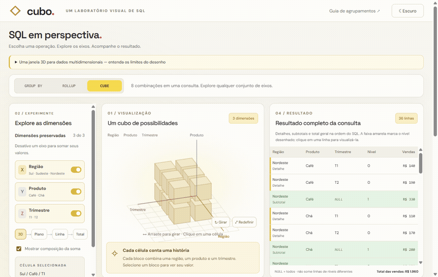

# Cubo · laboratório visual de SQL

O GIF mostra a interação principal: rotação 3D, colapso do cubo em plano, linha e total, além da mudança dos resultados ao alternar a operação SQL.

Abra `index.html` em um navegador moderno. Não requer instalação, build ou servidor. Fontes do Google são opcionais: a interface usa fontes locais se estiver offline.

Em notebooks e telas largas, controles, visualização e resultado ficam lado a lado, com rolagem interna da tabela e uma barra de operações compartilhada. Em tablets, os controles ficam acima da dupla desenho/tabela; em celulares, os painéis seguem em uma coluna. A barra de operações acompanha a rolagem. Os temas claro e escuro são alternáveis no topo.

## Como explorar

1. Arraste o cubo com mouse ou toque; com o canvas focado, use as setas. O botão Girar ativa rotação contínua.
2. Desative dimensões para transformar o cubo em um plano 2D, uma linha 1D e um total 0D. Apenas os eixos preservados aparecem; a composição da soma é mostrada em texto, sem reintroduzir blocos 3D nos níveis reduzidos.
3. Selecione uma célula no desenho ou uma linha da tabela para ver a soma correspondente.
4. Compare GROUP BY, ROLLUP e CUBE. O mapa de agrupamentos permite escolher cada nível; ROLLUP preserva os prefixos da ordem região, produto, trimestre.
5. Alterne entre o SQL da operação completa e o nível visualizado. Baixe um exemplo com os dados em uma CTE para executar no PostgreSQL.

## Dados e semântica

São 12 vendas fictícias: 3 regiões × 2 produtos × 2 trimestres, total de R$ 1.960. Cada nível conserva esse total. GROUP BY consulta um conjunto escolhido; ROLLUP gera 4 conjuntos e 22 linhas; CUBE gera 8 conjuntos e 36 linhas. Não se devem somar linhas de diferentes níveis para calcular o total geral.

A tabela mostra o resultado completo da operação: detalhes, subtotais verdes e total geral azul. NULL representa a dimensão agregada; GROUPING identifica o nível. Uma faixa amarela marca as linhas do nível desenhado, e clicar em qualquer linha seleciona seu nível e sua célula. GROUP BY mostra apenas o conjunto escolhido. A aba SQL “Nível visualizado” isola esse conjunto, mas não filtra a tabela completa.

O ORDER BY usa COLLATE "C" e NULLS LAST para reproduzir a ordenação da interface no PostgreSQL, com subtotais após os detalhes. Os resultados são calculados em JavaScript, sem conexão a um banco de dados; o SQL baixado permite reproduzi-los no PostgreSQL. O total do rodapé vem das vendas originais, sem somar repetidamente os níveis agregados.

Referência: https://www.postgresql.org/docs/current/queries-table-expressions.html#QUERIES-GROUPING-SETS

## Arquivos

- `index.html`: estrutura e conteúdo em português.
- `style.css`: layout responsivo e estilos.
- `app.js`: dados, agregações, SQL e projeção 3D em Canvas, sem bibliotecas.
- `assets/sql-cube-lab-demo.gif`: demonstração gravada da interface.

Validação: sintaxe JavaScript; oito conjuntos de agrupamento e conservação do total; contagem das linhas de ROLLUP e CUBE; seleção sincronizada com a tabela; rotação e layout móvel no navegador.
